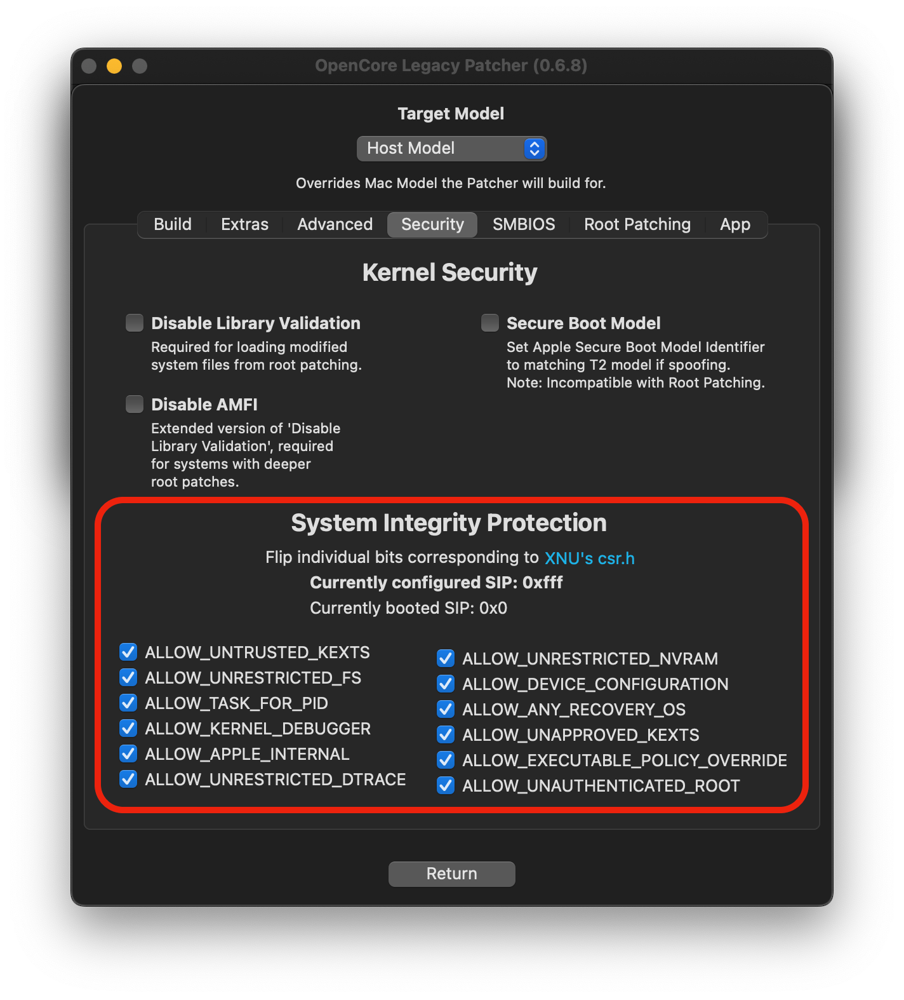
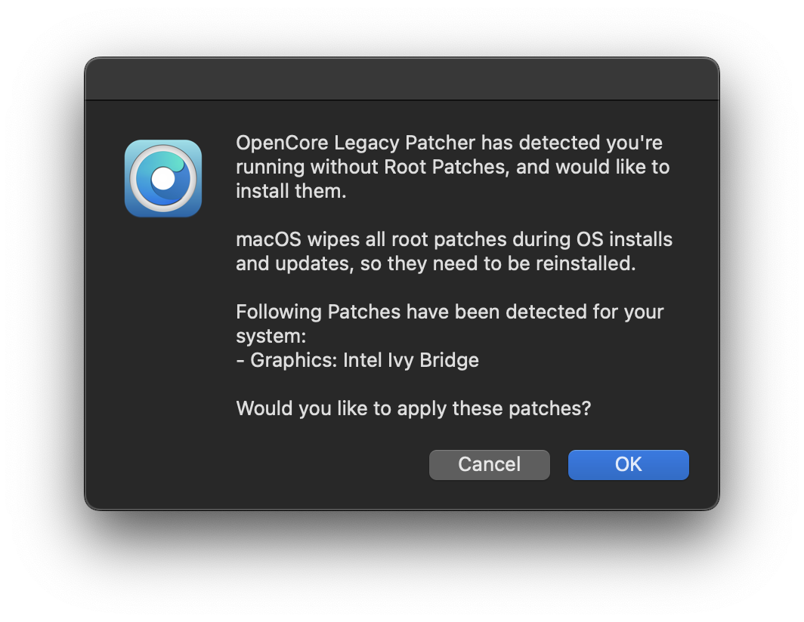

# Post-Installation

* [Booting without USB drive](#booting-without-usb-drive)
* [Booting seamlessly without Boot Picker](#booting-seamlessly-without-boot-picker)
* [SIP settings](#sip-settings)
* [Applying Post Install Volume Patches](#applying-post-install-volume-patches)

## Booting without USB drive

Once you've installed macOS through OpenCore, you can boot up and go through the regular install process. To boot without the USB drive plugged in is quite simple:

* Download OCLP-R
* Change Patcher settings as you'd like
* Build OpenCore again
* Install OpenCore to internal drive
* Reboot holding Option, and select the internal EFI

And voila! No more USB drive required.

If you're having issues with undetected internal disk, refer to [Internal disk missing when building OpenCore](https://dortania.github.io/OpenCore-Legacy-Patcher/TROUBLESHOOTING.html#internal-disk-missing-when-building-opencore) for troubleshooting.

## Booting seamlessly without Boot Picker

To do this, run the OpenCore Patcher and head to Patcher Settings, then uncheck "Show OpenCore Bootpicker" on the Build tab:

             

Once you've toggled it off, build your OpenCore EFI once again and install to your desired drive. Now to show the OpenCore selector, you can simply hold down the "ESC" key while clicking on EFI boot, and then you can release the "ESC" key when you see the cursor arrow at the top left.

## SIP settings

SIP, or System Integrity Protection, needs to be lowered on systems where root patching is required to patch data on disk. This will vary between OS versions and the model in question. 

OCLP by default will determine the proper SIP options for the OS version and Mac model, in most cases the user has no need to touch these settings.

:::warning

If you're unsure whether you should change the SIP settings, leave them as-is. Systems where you have already ran the Post Install Root Patching cannot enable SIP without potentially breaking the current install.

:::

| SIP Enabled | SIP Lowered (OCLP default) | SIP Disabled |
| :--- | :--- | :--- |
|  |  |  |

The guide in the dropdown below explains how the SIP settings work in OCLP, where lowered SIP is needed and where full SIP could be enabled.

::: details Configuring SIP manually (click to expand)

SIP settings can be accessed from the Security tab shown in the images. To change SIP settings, make the changes here, return in main menu and rebuild OpenCore using the first option.

In the cases where SIP can be enabled, manually enabling it is needed. 

Easiest way to check whether you can fully enable SIP is the "Post Install Root Patch" section, if that section tells your system doesn't need patches (or you don't install the patches e.g. in case you don't need WiFi on a Mac Pro with upgraded GPU running Monterey) then it is safe to assume full SIP can be enabled.

**Ventura and newer**

All unsupported systems require lowered SIP.

**Monterey**

Majority of unsupported systems from 2013 onward can enable full SIP.

Pre-2012 systems, also known as "non-Metal", as well as NVIDIA Kepler and Intel HD 4000 GPUs require lowered SIP. Mac Pros also require lowered SIP for stock WiFi cards and stock GPUs (due to root patching) but if you do not need WiFi (or you plan to upgrade it) and you're running on an upgraded GPU, there is no need for root patching and as such SIP can be fully enabled.

**Big Sur**

All Metal capable systems from 2012 onward (incl. NVIDIA Kepler and Intel HD 4000) as well as Mac Pros with upgraded GPU can run with full SIP enabled. 
Non-Metal systems still require lowered SIP.

:::

## Applying Post Install Volume Patches

Post Install Volume Patches, sometimes also called root patches, are patches that have to be installed to disk for some older Macs to gain back functionality.

These patches include things such as:

- Graphics drivers
- WiFi drivers
- Bluetooth drivers
- Touchbar / T1 drivers
- Built-in camera (iSight) drivers
- USB 1.1 drivers
- Other patches for compatibility with older drivers

OCLP will automatically root patch your system during a first time install **if the USB install media was created within OCLP and the proper model was selected before installer creation.** Users will also be prompted to install these patches after macOS updates or whenever patches are not detected on the system. We recommend rebuilding OpenCore with the latest version of OCLP to take advantage of these new features. 

Users can also see whether applicable patches have been installed, date and version the system was root patched with in the Post-Install Menu.

- **Note:** In some cases OCLP may require packages to be obtained from the internet, such as KDK or MetallibSupprtPkg if they do not already exist on the system. In these cases OCLP may only install the WiFi driver on first patch run to ensure you can connect to the internet, which means no graphics acceleration 
  after reboot. Root patching has to be ran again manually to install the rest of the required patches after internet connection is established to obtain the required packages.

   Check the affected systems and GPUs from the warnings below.

:::warning

If you need to use Migration Assistant to bring over data to your new macOS install, it is **highly recommended** to avoid restoring from inside Setup Assistant and waiting to install root patches until after the transfer is complete. If root patches were automatically installed, you can use the options available in the OCLP app to remove them.

Using Migration Assistant while patches are installed can lead to an unbootable system, requiring a reinstall of macOS.

For more information on how to restore a Time Machine backup, [refer to the guide here.](https://dortania.github.io/OpenCore-Legacy-Patcher/TIMEMACHINE.html)

:::

| Automatic install prompt | Status |
| :--- | :--- |
|  |   |

You can install and revert Root Patching manually from the app. 

| Listing Patches | Patching Finished |
| :--- | :--- |
|  |  |

:::warning

With macOS Sequoia, MetallibSupportPkg is required to be downloaded for all 3802-based systems. OCLP will handle this as long as you're connected to the internet.

3802 based GPUs:

* NVIDIA
    * Kepler (GTX 600 - 700 series)
* Intel
   * Ivy Bridge (HD 4000 series)
   * Haswell (Iris/HD 4000-5000 series)

:::

:::warning

With macOS Ventura and Macs with AMD Legacy GCN GPUs (ie. Metal), Root Patching requires a network connection to grab Apple's Kernel Debug Kit to start root patching. If your system is unable to connect to the internet, you can manually download a KDK from Apple's site:

* [Apple's Developer Download Page](https://developer.apple.com/download/all/?q=Kernel%20Debug%20Kit)

Grab the Kernel Debug Kit whose version is closest to the OS you installed, and install it to the machine running Ventura.

Machines that require this are those with AMD Metal dGPUs:
* 2008 - 2013 Mac Pros (MacPro3,1 - 6,1)
* 2009 - 2016 iMacs (iMac10,1 - 17,1)
* 2015 15" MacBook Pro with a dGPU (MacBookPro11,5)

:::

Below entries represent GPUs no longer natively supported, ie. requiring root volume patching with OCLP-R:

:::details GPUs requiring patching in different macOS versions

AMD Navi (RX 5000 - 6000 series) GPUs are non-functional in Mac Pro 2008 to 2012 using Ventura and newer due to lack of AVX2 support.

**Sequoia**

* NVIDIA:
  * Tesla (8000 - 300 series)
  * Kepler (600 - 800 series)
* AMD:
  * TeraScale (2000 - 6000 series)
  * GCN 1-3 (7000 - R9 series)
  * Polaris (RX 4xx/5xx series, if CPU lacks AVX2)
* Intel:
  * Iron Lake
  * Sandy Bridge (2000 - 3000 series)
  * Ivy Bridge (4000 series)
  * Haswell (4400, 4600, 5000 series)
  * Broadwell (6000 series)
  * Skylake (500 series)

**Sonoma**

* NVIDIA:
  * Tesla (8000 - 300 series)
  * Kepler (600 - 800 series)
* AMD:
  * TeraScale (2000 - 6000 series)
  * GCN 1-3 (7000 - R9 series)
  * Polaris (RX 4xx/5xx series, if CPU lacks AVX2)
* Intel:
  * Iron Lake
  * Sandy Bridge (2000 - 3000 series)
  * Ivy Bridge (4000 series)
  * Haswell (4400, 4600, 5000 series)
  * Broadwell (6000 series)
  * Skylake (500 series)

**Ventura**

* NVIDIA:
  * Tesla (8000 - 300 series)
  * Kepler (600 - 800 series)
* AMD:
  * TeraScale (2000 - 6000 series)
  * GCN 1-3 (7000 - R9 series)
  * Polaris (RX 4xx/5xx series, if CPU lacks AVX2)
* Intel:
  * Iron Lake
  * Sandy Bridge (2000 - 3000 series)
  * Ivy Bridge (4000 series)
  * Haswell (4400, 4600, 5000 series)
  * Broadwell (6000 series)
  * Skylake (500 series)

**Monterey**

* NVIDIA:
  * Tesla (8000 - 300 series)
  * Kepler (600 - 800 series)
* AMD:
  * TeraScale (2000 - 6000 series)
* Intel:
  * Iron Lake
  * Sandy Bridge (2000 - 3000 series)
  * Ivy Bridge (4000 series)

**Big Sur**

* NVIDIA:
  * Tesla (8000 - 300 series)
* AMD:
  * TeraScale (2000 - 6000 series)
* Intel:
  * Iron Lake
  * Sandy Bridge (2000 - 3000 series)

:::

:::details Wireless Cards requiring patching in macOS Monterey

* Broadcom:
  * BCM94328
  * BCM94322
* Atheros

:::
